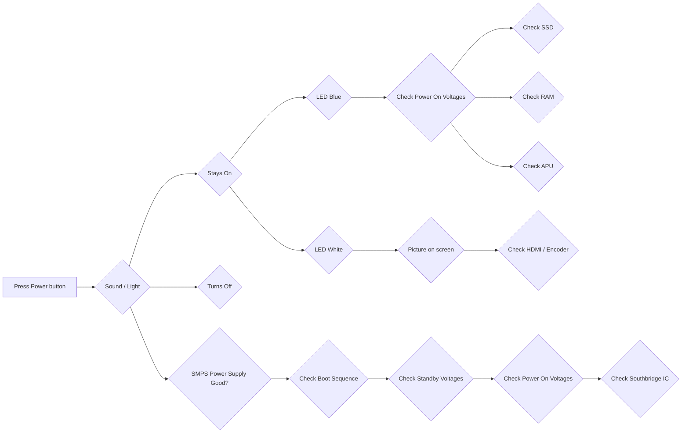

#PlayStation 5 Troubleshooting

## Introduction
Place holder.

## Flow Diagram Troubleshooting

```mermaid
graph LR; Start[Press Power button] 
-->SoundLight{Sound / Light}; 
SoundLight -->StaysOn{Stays On}; 
SoundLight -->TurnsOff{Turns Off};

StaysOn-->IsLedBlue{LED Blue};
StaysOn-->IsLedWhite{LED White};
IsLedBlue-->CheckPowerOnVoltages{Check Power On Voltages};
CheckPowerOnVoltages-->CheckSsd{Check SSD};
CheckPowerOnVoltages-->CheckRam{Check RAM};
CheckPowerOnVoltages-->CheckApu{Check APU};
IsLedWhite-->PictureOnScreen{Picture on screen};
PictureOnScreen-->HdmiEncoder{Check HDMI / Encoder};


SoundLight -->SmpsPowerSupplyGood{SMPS Power Supply Good?};
SmpsPowerSupplyGood-->CheckBootSeq{Check Boot Sequence};
CheckBootSeq-->CheckStandByVolts{Check Standby Voltages};
CheckStandByVolts-->CheckPowerOnVolts{Check Power On Voltages};
CheckPowerOnVolts-->CheckSouthBridge{Check Southbridge IC};
```

## UART Locations
